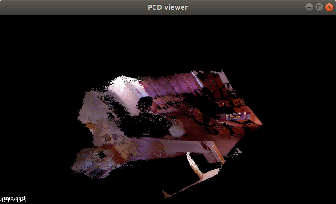

# Join Point Cloud

This program does the following things:

* Compute the corresponding point cloud of a group of RGB-D images according to the camera intrinsics
* Join the point cloud of each image together to form a map according to the camera pose (camera extrinsics).

> *color* folder contains the color image. *depth* folder contains the depth image. *pose.txt* is the camera pose record

## Environment

Ubuntu 18.04LTS

## Build

Execute the following commands in terminal (in the directory containing main.cc) to build the program

```bash
mkdir build
cd build
cmake ..
make
```

## Run & Check Result

After building the program, there should be a executable file named *join_pointcloud* in the *build* folder. 

The following command need to be executed in *build* folder

```bash
cp join_pointcloud ..
../join_pointcloud
```

> Copy the executable to the same directory with *depth*, *color* and *pose.txt* so that the program can function normally. You can edit the source code to change where the program load data.

The program will generate a pcd file named *map.pcd* containing the result point cloud. To visualize the point cloud, execute the following command.

```bash
pcl_viewer map.pcd
```

If you do not have *pcl_viewer* installed, use the following command to install it

```
sudo apt install pcl-tools
```

The result should look like this



* sheared_ptr
* new operator in cpp
* aligned_allocator